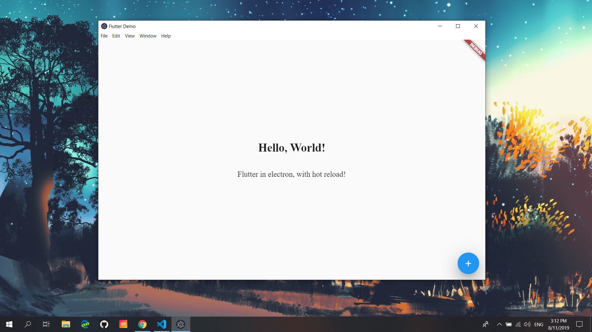

# electron-quick-start-flutter
A minimal Electron application with flutter & dart



## To Use

```bash
# Clone this repository
git clone https://github.com/hayderux/electron-quick-start-flutter
# Go into the repository
cd electron-quick-start-flutter
#install flutter dependencies
flutter pub get
# Install dependencies
npm install
# Run the app
npm run dev
```


 
## Release
To build for production, first run `npm run build`.

The output directory, `build` contains a `package.json` pointing to the built
application, and can be run as follows:

```bash
cd build
npm install
npm start
```
## Package
The output directory's package manifest, build/package.json, includes electron-packager, and therefore can be packaged for distribution on Windows, MacOS, and Linux.

to build for the host platform run:
``` 
npm run build
```
To build for all platforms, run :

``` 
npm run package
```
